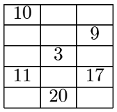

# OSN 2002

## English Translation

1. Prove that $n^4 - n^2$ is divisible by $12$ for all integers $n > 1$.

2. Five dices are rolled. The product of the faces are then computed. Which result has a larger probability of occurring; $180$ or $144$?

3. Find all solutions (real and complex) for $x,y,z$, given that:
$$x+y+z = 6$$
$$x^2+y^2+z^2 = 12$$
$$x^3+y^3+z^3 = 24$$

4. Given a triangle $ABC$ where $AC > BC$, $D$ is located on the circumcircle of $ABC$ such that $D$ is the midpoint of the arc $AB$ that contains $C$. $E$ is a point on $AC$ such that $DE$ is perpendicular to $AC$. Prove that $AE = EC + CB$.

5. Nine of the numbers $4, 5, 6, 7, 8, 12, 13, 16, 18, 19$ are going to be inputted to the empty cells in the following table: 
 
such that each row sums to the same number, and each column sums to the same number. Determine all possible arrangements.

6. Find all primes $p$ such that $4p^2+1$ and $6p^2+1$ are both primes.

7. Let $ABCD$ be a rhombus where $\angle DAB = 60^\circ$, and $P$ be the intersection between $AC$ and $BD$. Let $Q,R,S$ be three points on the boundary of $ABCD$ such that $PQRS$ is a rhombus. Prove that exactly one of $Q,R,S$ lies on one of $A,B,C,D$.

## Original

1. 