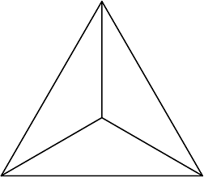

# OSN 2003

## English Translation

1. Prove that $a^9 - a$ is divisible by $6$ for all integers $a$.

2. Let $ABCD$ be a quadrilateral, and $P,Q,R,S$ are the midpoints of $AB, BC, CD, DA$ respectively. Let $O$ be the intersection between $PR$ and $QS$. Prove that $PO = OR$ and $QO = OS$.

3. Find all real numbers $x$ such that $\left\lfloor x^2 \right\rfloor + \left\lceil x^2 \right\rceil = 2003$.

4. Given a $19 \times 19$ matrix where each component is either $1$ or $-1$. Let $b_i$ be the product of all components in the $i$-th row, and $k_i$ be the product of all components in the $i$-th column, for all $1 \le i \le 19$. Prove that for any such matrix, $b_1 + k_1 + b_2 + k_2 + \cdots + b_{19} + k_{19} \neq 0$.

5. For any real numbers $a,b,c$, prove that
$$ 5a^2 + 5b^2 + 5c^2 \ge 4ab + 4ac + 4bc $$
and determine when equality occurs.

6. The hall in a castle is a regular hexagon where its sides' length is 6 meters. The floor of the hall is to be tiled with equilateral triangular tiles where its sides' length is 50 centimeters. Each tile is divided into three congruent triangles by their altitudes up to its orthocenter (see below). Each of these small triangles are colored such that each tile has different colors and no two tiles have identical colorings. How many colors at least are required?
A tile's pattern is:

7. Let $k,m,n$ be positive integers such that $k > n > 1$ and $(k,n) = 1$. If $k-n | k^m - n^{m-1}$, prove that $k \le 2n - 1$.

## Original

1. 