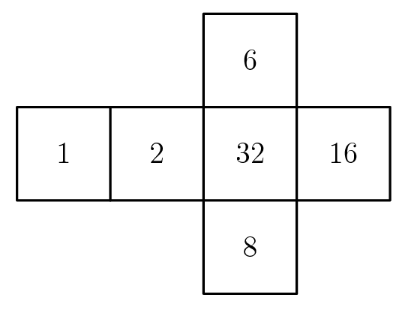

# OSN 2011

## English Translation

### Day 1

1. For a number $n$ in base $10$, let $f(n)$ be the sum of all numbers possible by removing some digits of $n$ (including none and all). For example, if $n = 1234$, $f(n) = 1234 + 123 + 124 + 134 + 234 + 12 + 13 + 14 + 23 + 24 + 34 + 1 + 2 + 3 + 4 = 1979$; this is formed by taking the sums of all numbers obtained when removing no digit from $n$ (1234), removing one digit from $n$ (123, 124, 134, 234), removing two digits from $n$ (12, 13, 14, 23, 24, 34), removing three digits from $n$ (1, 2, 3, 4), and removing all digits from $n$ (0). If $p$ is a 2011-digit integer, prove that $f(p)-p$ is divisible by $9$.
Remark: If a number appears twice or more, it is counted as many times as it appears. For example, with the number $101$, $1$ appears three times (by removing the first digit, giving $01$ which is equal to $1$, removing the first two digits, or removing the last two digits), so it is counted three times.

2. For each positive integer $n$, let $s_n$ be the number of permutations $(a_1, a_2, \cdots, a_n)$ of $(1, 2, \cdots, n)$ such that $\dfrac{a_1}{1} + \dfrac{a_2}{2} + \cdots + \dfrac{a_n}{n}$ is a positive integer. Prove that $s_{2n} \ge n$ for all positive integer $n$.

3. Given an acute triangle $ABC$, let $l_a$ be the line passing $A$ and perpendicular to $AB$, $l_b$ be the line passing $B$ and perpendicular to $BC$, and $l_c$ be the line passing $C$ and perpendicular to $CA$. Let $D$ be the intersection of $l_b$ and $l_c$, $E$ be the intersection of $l_c$ and $l_a$, and $F$ be the intersection of $l_a$ and $l_b$. Prove that the area of the triangle $DEF$ is at least three times of the area of $ABC$.

4. An island has $10$ cities, where some of the possible pairs of cities are connected by roads. A tour route is a route starting from a city, passing exactly eight out of the other nine cities exactly once each, and returning to the starting city. (In other words, it is a loop that passes only nine cities instead of all ten cities.) For each city, there exists a tour route that doesn't pass the given city. Find the minimum number of roads on the island.

### Day 2

5. The image above is a net of a unit cube. Let $n$ be a positive integer, and let $2n$ such cubes are placed to build a $1 \times 2 \times n$ cuboid which is placed on a floor. Let $S$ be the sum of all numbers on the block visible (not facing the floor). Find the minimum value of $n$ such that there exists such cuboid and its placement on the floor so $S > 2011$.

6. Let a sequence of integers $a_0, a_1, a_2, \cdots, a_{2010}$ such that $a_0 = 1$ and $2011$ divides $a_{k-1}a_k - k$ for all $k = 1, 2, \cdots, 2010$. Prove that $2011$ divides $a_{2010} + 1$.

7. Let $a,b,c \in \mathbb{R}^+$ and $abc = 1$ such that $a^{2011} + b^{2011} + c^{2011} < \dfrac{1}{a^{2011}} + \dfrac{1}{b^{2011}} + \dfrac{1}{c^{2011}}$. Prove that $a + b + c < \dfrac{1}{a} + \dfrac{1}{b} + \dfrac{1}{c}$.

8. Given a triangle $ABC$. Its incircle is tangent to $BC, CA, AB$ at $D, E, F$ respectively. Let $K, L$ be points on $CA, AB$ respectively such that $K \neq A \neq L, \angle EDK = \angle ADE, \angle FDL = \angle ADF$. Prove that the circumcircle of $AKL$ is tangent to the incircle of $ABC$.

## Original

### Hari Pertama

1.

### Hari Kedua

5. 