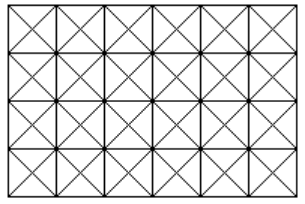

# OSN 2013

## English Translation

### Day 1

1. In a $4 \times 6$ grid, all edges and diagonals are drawn as shown above. Determine the number of parallelograms in the grid that uses only the line segments drawn and none of its four angles are right.

2. Let $ABC$ be an acute triangle and $\omega$ be its circumcircle. The bisector of $\angle BAC$ intersects $\omega$ at [another point] $M$. Let $P$ be a point on $AM$ and inside $\triangle ABC$. Lines passing $P$ that are parallel to $AB$ and $AC$ intersects $BC$ on $E, F$ respectively. Lines $ME, MF$ intersects $\omega$ at points $K, L$ respectively. Prove that $AM, BL, CK$ are concurrent.

3. Determine all positive real $M$ such that for any positive reals $a,b,c$, at least one of $a + \dfrac{M}{ab}, b + \dfrac{M}{bc}, c + \dfrac{M}{ca}$ is greater than or equal to $1+M$.

4. Suppose $p > 3$ is a prime number and
$$S = \sum_{2 \le i < j < k \le p-1} ijk$$
Prove that $S+1$ is divisible by $p$.

### Day 2

5. Let $P$ be a quadratic (polynomial of degree two) with a positive leading coefficient and negative discriminant. Prove that there exists three quadratics $P_1, P_2, P_3$ such that:
    - $P(x) = P_1(x) + P_2(x) + P_3(x)$
    - $P_1, P_2, P_3$ have positive leading coefficients and zero discriminants (and hence each has a double root)
    - The roots of $P_1, P_2, P_3$ are different

6. A positive integer $n$ is called "strong" if there exists a positive integer $x$ such that $x^{nx} + 1$ is divisible by $2^n$.
(a) Prove that $2013$ is strong.
(b) If $m$ is strong, determine the smallest $y$ (in terms of $m$) such that $y^{my} + 1$ is divisible by $2^m$.

7. Let $ABCD$ be a parallelogram. Construct squares $ABC_1D_1, BCD_2A_2, CDA_3B_3, DAB_4C_4$ on the outer side of the parallelogram. Construct a square having $B_4D_1$ as one of its sides and it is on the outer side of $AB_4D_1$ and call its center $O_A$. Similarly do it for $C_1A_2, D_2B_3, A_3C_4$ to obtain $O_B, O_C, O_D$. Prove that $AO_A = BO_B = CO_C = DO_D$.

8. Let $A$ be a set of positive integers. $A$ is called "balanced" if [and only if] the number of 3-element subsets of $A$ whose elements add up to a multiple of $3$ is equal to the number of 3-element subsets of $A$ whose elements add up to not a multiple of $3$.
(a) Find a 9-element balanced set.
(b) Prove that no set of $2013$ elements can be balanced.

## Original

### Hari Pertama

1.

### Hari Kedua

5. 